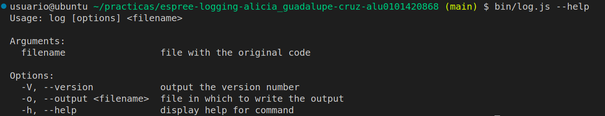
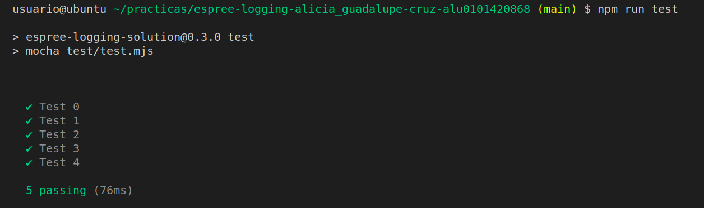
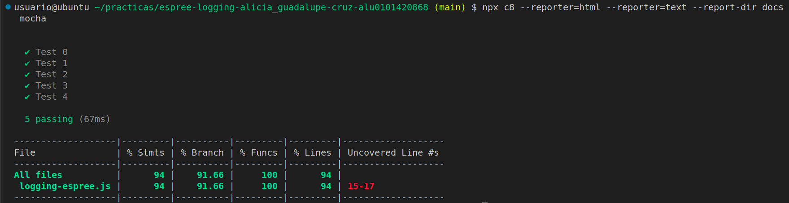
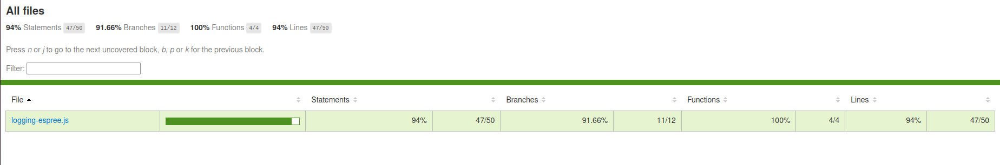
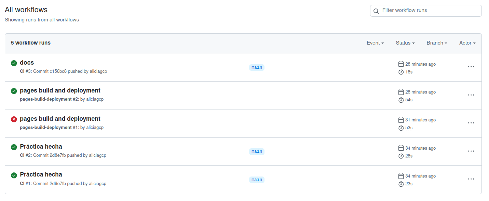
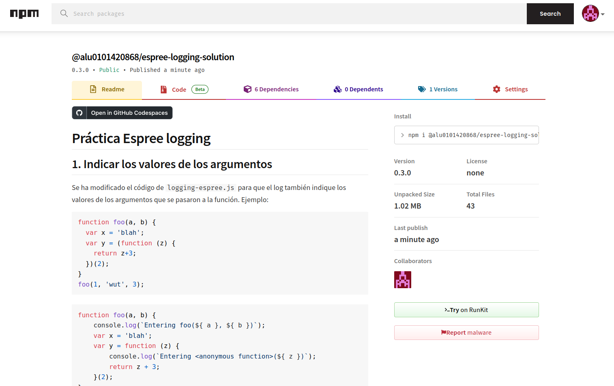

[](https://classroom.github.com/open-in-codespaces?assignment_repo_id=10331479)
# Práctica Espree logging

## 1. Indicar los valores de los argumentos

Se ha modificado el código de `logging-espree.js` para que el log también indique los valores de los argumentos que se pasaron a la función. 
Ejemplo:

```javascript
function foo(a, b) {
  var x = 'blah';
  var y = (function (z) {
    return z+3;
  })(2);
}
foo(1, 'wut', 3);
```

```javascript
function foo(a, b) {
    console.log(`Entering foo(${ a }, ${ b })`);
    var x = 'blah';
    var y = function (z) {
        console.log(`Entering <anonymous function>(${ z })`);
        return z + 3;
    }(2);
}
foo(1, 'wut', 3);
```

## 2. CLI con [Commander.js](https://www.npmjs.com/package/commander)

- En log.js

```javascript
program
  .version(version)
  .argument("<filename>", 'file with the original code')
  .option("-o, --output <filename>", "file in which to write the output")
  .action((filename, options) => {
    transpile(filename, options.output);
  });
```

- El programa admite la introducción por línea de comandos



## 3. Reto 1: Soportar funciones flecha

- En `logging-espree.js` se ha añadido la función `isArrowFunctionExpression` que devuelve `true` si el nodo es una función flecha.

```javascript
/**
 * @desc Add logging to the code.
 * @param {*} code - The code to add logging to.
 * @returns {string} - The code with logging added.
 */
export function addLogging(code) {
  const ast = espree.parse(code, { ecmaVersion: 12, loc: true });
  estraverse.traverse(ast, {
    enter: function (node, parent) {
      if (node.type === 'FunctionDeclaration' ||
          node.type === 'FunctionExpression' ||
          node.type === 'ArrowFunctionExpression') {
        addBeforeCode(node);
      }
    }
  });
  return escodegen.generate(ast);
}
```

## 4. Reto 2: Añadir el número de línea

- En `logging-espree.js` se ha modificado la función `addBeforeCode` para que indique el número de línea.

```javascript
/**
 * @desc Add logging code before the function.
 * @param {*} node - The function node.
 */
function addBeforeCode(node) {
  const name = node.id ? node.id.name : '<anonymous function>';
  const params = node.params.map(p => '${ ' +  p.name + ' }').join(', ');
  const beforeCode = 'console.log(\`Entering ' + name + '(' + params + ') at line ' + node.loc.start.line + '\`);';
  const beforeNodes = espree.parse(beforeCode, { ecmaVersion: 12 }).body;
  node.body.body = beforeNodes.concat(node.body.body);
}
```

## 5. Tests and Covering

- En `test-description.mjs` se han añadido test para comprobar la funcionalidad del programa

```mjs
export default [
  {
    input: 'test1.js',
    output: 'logged1.js',
    correctLogged: 'correct-logged1.js',
    correctOut: 'logged-out1.txt'
  },
  {
    input: 'test2.js',
    output: 'logged2.js',
    correctLogged: 'correct-logged2.js',
    correctOut: 'logged-out2.txt'
  },
  {
    input: 'test3.js',
    output: 'logged3.js',
    correctLogged: 'correct-logged3.js',
    correctOut: 'logged-out3.txt'
  },
  {
    input: 'test4.js',
    output: 'logged4.js',
    correctLogged: 'correct-logged4.js',
    correctOut: 'logged-out4.txt'
  },
  {
    input: 'test5.js',
    output: 'logged5.js',
    correctLogged: 'correct-logged5.js',
    correctOut: 'logged-out5.txt'
  },
]
```

- En `test.mjs` se ha añadido un fragmento de código para comprobra el correcto funcionamiento del programa

```mjs
for (let i = 0; i < Test.length; i++) {
  it ('Test ' + i, async function () {
    const t = Test[i];
    await transpile(t.input, t.output);
    const correctLogged = await fs.readFile(t.correctLogged, 'utf-8');
    assert.equal(removeSpaces(correctLogged), removeSpaces(await fs.readFile(t.output, 'utf-8')));

    let outputs = [];
    let oldLog = console.log;
    console.log =
        function(...args) {
      outputs.push(args.join(' '));
    }

    await import(t.output);
    console.log = oldLog;
    const correctOut = await fs.readFile(t.correctOut, 'utf-8');
    assert.equal(removeSpaces(outputs.join('\n')), removeSpaces(correctOut));
  });
}
```

- Podemos comprobar que todos los test pasan correctamente



## 6. Se añade un estudio de cubrimiento de las pruebas (coverage) y se ha publicado en Github pages

- Usando: 

```bash
npx c8 --reporter=html --reporter=text --report-dir docs mocha
```



- En [Github pages](https://ull-esit-pl-2223.github.io/espree-logging-alicia_guadalupe-cruz-alu0101420868/)



## 7. Se hace integración continua usando Github Actions

- En `nodes.yml`

```yml
# Write your workflow for CI here
name: CI

# Controls when the workflow will run
on:
  # Triggers the workflow on push or pull request events but only for the $default-branch branch
  push:
    branches: [ main ]
  pull_request:
    branches: [ main ]

# A workflow run is made up of one or more jobs that can run sequentially or in parallel
jobs:
  # This workflow contains a single job called "build"
  test:
    # The type of runner that the job will run on
    runs-on: ubuntu-latest

    # Steps represent a sequence of tasks that will be executed as part of the job
    steps:
      # Checks-out your repository under $GITHUB_WORKSPACE, so your job can access it
      - uses: actions/checkout@v2

      # Test the code
      - name: Test
        run: npm ci && npm test
```


## 8. NPM

- Se ha publicado el paquete en [NPM](https://www.npmjs.com/package/espree-logging-alicia_guadalupe-cruz-alu0101420868)

- Para loquearnos en NPM usamos:

```bash
npm login
```

- Para publicar el paquete usamos:

```bash
npm publish --access=public
```


